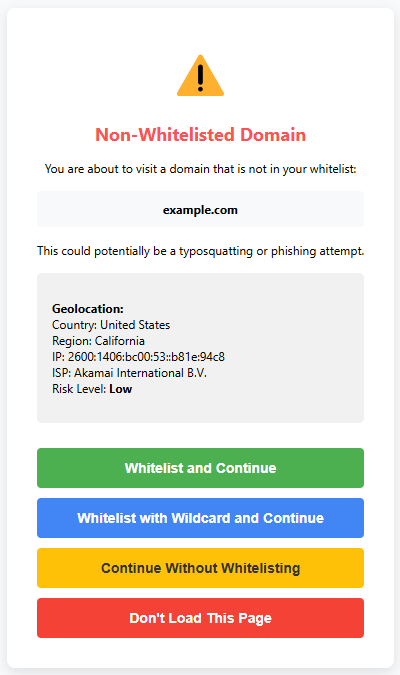
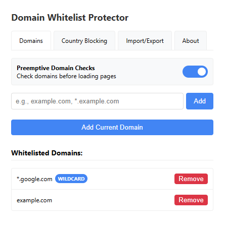

# Domain Whitelist Protector


A browser extension that protects against typosquatting and phishing by showing warnings for non-whitelisted domains.

## 🛡️ Features

- **Preemptive Domain Protection**: Get alerted before visiting non-whitelisted domains
- **Visual Warning Bar**: See a clear red warning banner on non-whitelisted websites
- **Flexible Configuration**: Choose to whitelist domains permanently or allow temporarily for a session
- **Import/Export Functionality**: Easily backup and transfer your whitelist between devices
- **Simple Management**: Add the current domain to your whitelist with a single click

## 📸 Screenshots

| Warning Bar                            | Confirmation Page                             | Settings Panel                                |
| -------------------------------------- | --------------------------------------------- | --------------------------------------------- |
|  |  |  |

## 🔍 How It Works

1. **Domain Protection**: When you visit a website, the extension checks if the domain is in your whitelist
2. **Safe Navigation**: For non-whitelisted domains, the extension shows a confirmation page
3. **User Control**: You decide whether to continue, whitelist, or exit from the suspicious domain
4. **Session Allowance**: Choose to allow a domain just for the current session without adding it to your permanent whitelist

## 🚀 Installation

### Chrome Web Store

[](https://chrome.google.com/webstore/)

### Mozilla Add-ons

[](https://addons.mozilla.org/en-US/firefox/)

## 🛠️ Manual Installation

### Chrome

1. Download this repository as a ZIP file and unpack it
2. Go to `chrome://extensions/`
3. Enable "Developer mode"
4. Click "Load unpacked" and select the unpacked src/ directory

### Firefox

1. Download this repository as a ZIP file and unpack it
2. Rename `src/manifest.json` to `src/manifest.chrome.json`
3. Rename `src/manifest.firefox.json` to `src/manifest.json`
4. Go to `about:debugging#/runtime/this-firefox`
5. Click "Load Temporary Add-on"
6. Select any file in the unpacked src/ directory

## 🔒 Privacy

This extension:

- Does not collect any data about your browsing habits
- Does not send any information to remote servers
- Stores your whitelist only on your local machine
- Requires minimal permissions to function

## 👨‍💻 For Developers

### Project Structure

```
domain-whitelist-protector/src/
├── manifest.json        # Extension configuration
├── background.js        # Main extension logic
├── content.js           # Content script for warning bar
├── popup.html           # Whitelist management UI
├── popup.js             # Whitelist management logic
├── confirmation.html    # Safety confirmation page
├── confirmation.js      # Confirmation page logic
├── styles.css           # Warning bar styles
└── images/              # Extension icons
```

### Building from Source

```bash
# Clone the repository
git clone https://github.com/infnada/typosquatting-protect.git

# Navigate to the directory
cd typosquatting-protect

# Build the extension
node scripts/build.js build
```

## 📝 License

This project is licensed under the MIT License - see the [LICENSE](LICENSE) file for details.

## 💡 Contributing

Contributions are welcome! Please feel free to submit a Pull Request.

1. Fork the repository
2. Create your feature branch (`git checkout -b feature/amazing-feature`)
3. Commit your changes (`git commit -m 'Add some amazing feature'`)
4. Push to the branch (`git push origin feature/amazing-feature`)
5. Open a Pull Request

## 🙏 Acknowledgements

- 99% of this extension was made by claude.ai
- Everyone who has contributed to the project

---

<p align="center">
  Made with ❤️ for a safer browsing experience
</p>
